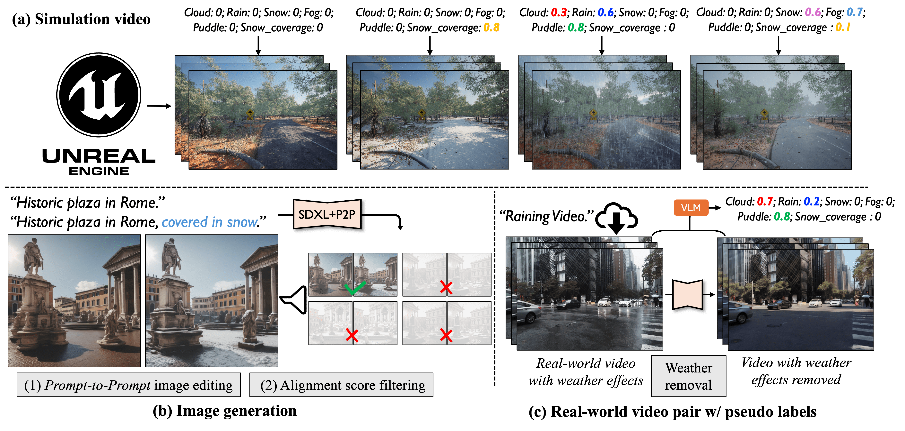

<h1 align="center"> Controllable Weather Synthesis and Removal
with Video Diffusion Models</h1>

<b>ICCV 2025</b>

<a href="https://research.nvidia.com/labs/toronto-ai/WeatherWeaver/" target="_blank">Project Page</a> | <a href="https://arxiv.org/abs/2505.00704" target="_blank">Paper</a>

<a href="https://chih-hao-lin.github.io/" target="_blank">Chih-Hao Lin1,2</a>, 
<a href="https://www.cs.toronto.edu/~zianwang/" target="_blank">Zian Wang1,3,4</a>, 
<a href="https://www.cs.toronto.edu/~ruofan/" target="_blank">Ruofan Liang1,3,4</a>, 
<a href="https://scholar.google.com/citations?user=Jt5VvNgAAAAJ&hl=en" target="_blank">Yuxuan Zhang1</a>, 
<a href="https://www.cs.toronto.edu/~fidler/" target="_blank">Sanja Fidler1,3,4</a>, 
<a href="https://shenlong.web.illinois.edu/" target="_blank">Shenlong Wang2</a>,  
<a href="https://zgojcic.github.io/" target="_blank">Zan Gojcic1</a>, 

1NVIDIA, 2UIUC, 3University of Toronto, 4Vector Institute

This repo provides links to the simulation and generation data used to train WeatherWeaver model.

### Simulation Data
Links to each scenes:
- [Scene 0](https://huggingface.co/datasets/chih-hao-lin/WeatherWeaver_simulation_scene0)
- [Scene 1](https://huggingface.co/datasets/chih-hao-lin/WeatherWeaver_simulation_scene1)
- [Scene 2](https://huggingface.co/datasets/chih-hao-lin/WeatherWeaver_simulation_scene2)
- [Scene 3](https://huggingface.co/datasets/chih-hao-lin/WeatherWeaver_simulation_scene3)

### Generation Data
- [Link to dataset](https://huggingface.co/datasets/chih-hao-lin/WeatherWeaver_generation)
